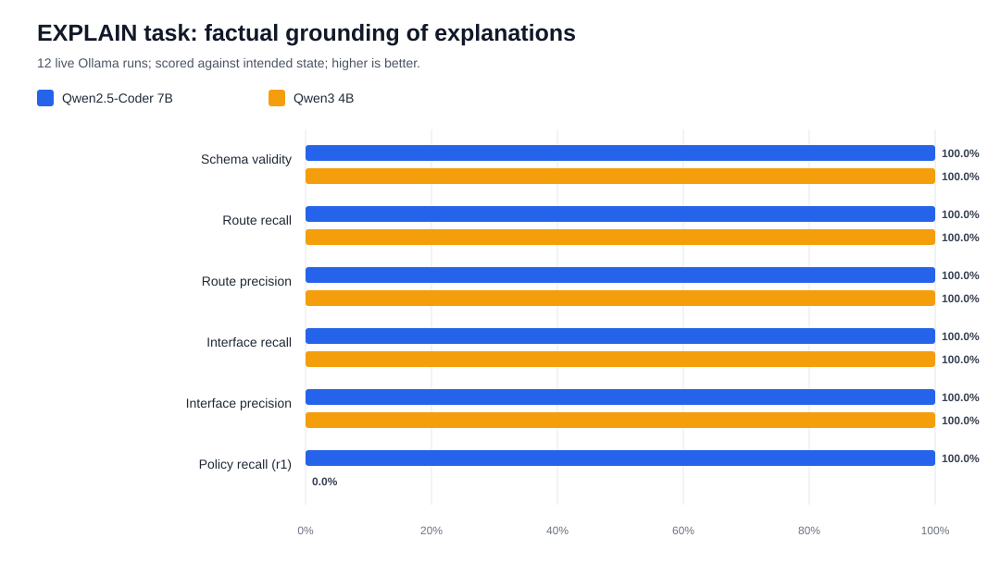
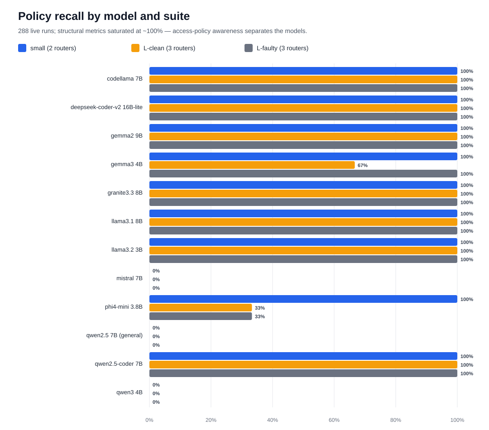
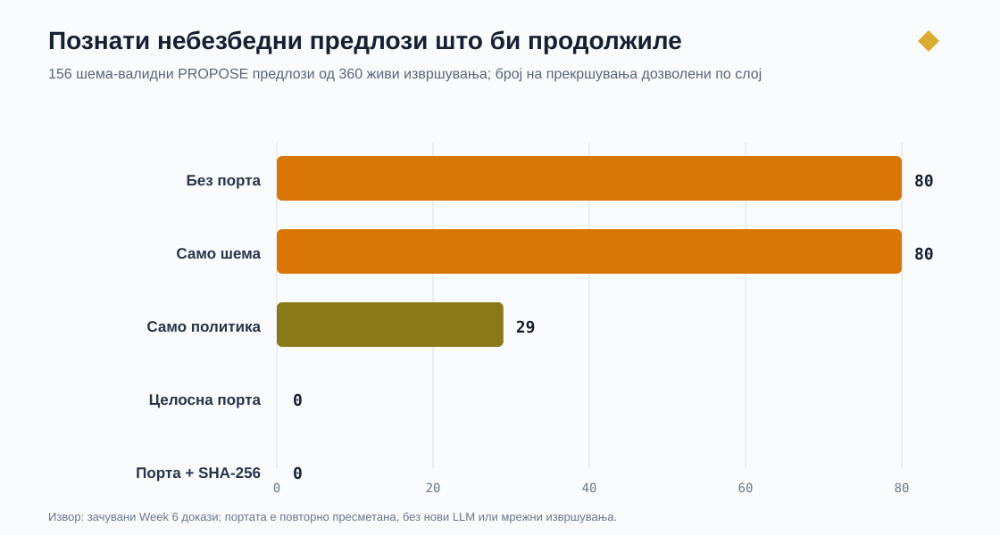
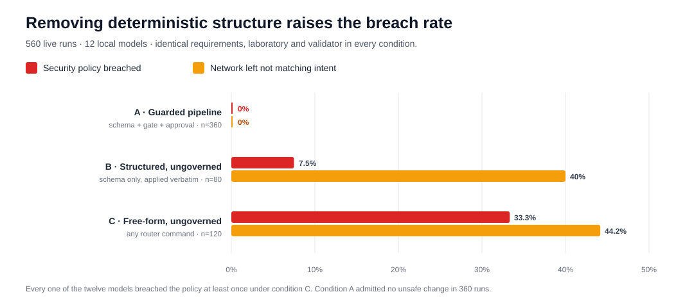

# Готови текстови за вметнување во трудот — 26 јули 2026

Секој блок е подготвен за директно вметнување (copy/paste) во соодветното поглавје. Референците се означени со [❑] — замени ги со твојот стил на цитирање. Провери ги arXiv-верзиите пред финално поднесување.

---

## 1. За „Сродни истражувања" (кластер А — LLM за мрежна конфигурација)

Најновите бенчмарки од 2026 година независно го потврдуваат пристапот избран во овој труд. Cornetto [❑ Protogeros, Asadli, Hoffman, Vanbever — ETH Zürich, arXiv:2604.22513] е првиот бенчмарк за LLM-водена поправка на мрежни конфигурации во голем обем: 231 сценарија со погрешни конфигурации, топологии од 20 до 754 јазли и девет современи модели. Наодите се јасни — моделите често внесуваат регресии при поправката, а нивните перформанси опаѓаат со растот на мрежата. Заклучокот на авторите е дека доверливата автоматизација со LLM бара нивна интеграција во работни текови водени од формална верификација. Слично, евалуацијата на агентски пристапи за поправка на конфигурации [❑ arXiv:2606.06212] покажува дека автономните агентски јамки остануваат ризични во критична инфраструктура. Овие трудови во голем обем доаѓаат до истиот заклучок што овој труд го демонстрира од крај до крај во мала, целосно мерена лабораториска околина: излезот од LLM мора да биде ограничен со детерминистичка валидација и експлицитно одобрување пред каква било примена. Разликата во пристапот е суштинска — агентските системи ја користат верификацијата за автономна итерација со моделот, додека овој труд ја користи како порта за одобрување со човечка одлука и одговорност.

## 2. За „Заклучок" или крај на „Сродни истражувања" (истакнување на придонесот)

Вреди да се истакне дека ниту еден од трите најнови бенчмарки за LLM-водено мрежно управување од 2026 година [❑ Cornetto; NetAgentBench, arXiv:2604.09678; Network Arena, arXiv:2512.16381] не имплементира криптографско врзување на човечкото одобрување за конкретниот артефакт што се применува. Во системот развиен во овој труд, одобрувањето е врзано со SHA-256 отпечаток од точните бајти на предлогот, пресметан повторно непосредно пред примената. Со тоа авторизацијата се однесува на конкретен, непроменлив артефакт, а не на неформален опис на намерата на моделот — својство што евалуациската литература сè уште не го адресира.

## 3. За Поглавје 5 или 6 (една реченица — ревизија на базните конфигурации)

Базните конфигурации на r1 и r2 беа дополнително проверени со класи на проверки вообичаени во индустриската пракса за преглед пред примена (детекција на опасни команди, преклопување на подмрежи, дупликат адреси, достапност на next-hop адресите и симетрија на рутите); сите проверки завршија со PASS (docs/tools/preflight_frr.py).

## 4. За Поглавје 6 (методологија на EXPLAIN задачата — нов дел, ~6.x)

### 6.x Објаснување на постоечки конфигурации

Покрај толкувањето на барања и подготовката на предлози, описот на трудот предвидува и трета асистивна улога: објаснување на постоечки конфигурации. За нејзино мерење беше дефинирана EXPLAIN задача: моделот ја прима суровата конфигурација на еден рутер (frr.conf, за r1 дополнета со применетите iptables правила) и мора да врати структурирано објаснување според строга Pydantic шема — резиме на улогата на уредот, листа на интерфејси, статички рути и пристапни правила, секое со кратко образложение на намената.

Клучна методолошка одлука е дека моделот го добива само конфигурацискиот текст, никогаш датотеката со намера. Фактичката точност на објаснувањето потоа се оценува детерминистички според intent/intended_state.yaml — истиот извор на вистина што ги напојува двата валидатора. Согласноста затоа мери вистинска фактичка втемеленост, а не повторување на промптот. Се известуваат следниве метрики по модел: валидност на шемата, recall и precision за рутите (пропуштени наспроти измислени рути), recall и precision за интерфејсите, recall за пристапната политика (само r1) и број на халуцинирани ентитети — адреси или префикси што не постојат во инвентарот. Матрицата опфаќа 2 уреди × 2 модели × 3 повторувања = 12 живи извршувања со истите детерминистички поставки (температура 0, seed 42).

**Прелиминарни резултати со два модела (12 живи извршувања, 26 јули 2026; docs/evidence/week6-explain/).** Проширената кампања со дванаесет модели е во делот 6.y подолу и претставува главниот резултат; оваа табела се задржува како појдовна точка.

| Метрика | Qwen2.5-Coder 7B | Qwen3 4B |
|---|---:|---:|
| Валидност на шемата | 100% | 100% |
| Recall на рути | 100% | 100% |
| Precision на рути | 100% | 100% |
| Recall на интерфејси | 100% | 100% |
| Precision на интерфејси | 100% | 100% |
| Recall на политика (r1) | **100%** | **0%** |
| Халуцинирани ентитети | 0 | 0 |
| Ладен старт / медијана топли извршувања | 12,89 s / 5,87 s | 9,77 s / 3,82 s |

Двата модела покажаа совршена структурна втемеленост: сите интерфејси и статички рути беа идентификувани точно, без ниту еден халуциниран ентитет. Дискриминирачкиот резултат е recall на политиката. Qwen2.5-Coder ја идентификуваше и објасни deny-политиката на r1 во сите три повторувања, додека Qwen3 врати празна листа на пристапни правила во сите три повторувања — чиста грешка од класата пропуст (omission) според таксономијата на грешки: помалиот модел ја прочита рутирачката структура беспрекорно, но целосно го изостави безбедносно релевантниот дел од конфигурацијата. Идентичните излези во сите повторувања се конзистентни со детерминистичките поставки, со истата ограда како кај V2 кампањата: повторувањата не претставуваат независни статистички опсервации. Наодот е конзистентен со V2 резултатите, каде помалиот модел правеше повеќе семантички и класификациски грешки, и директно ја поткрепува централната теза: точното објаснување на структурата не гарантира точно објаснување на безбедносната семантика, па затоа и објаснувањата — не само предлозите — мора да се проверуваат детерминистички според декларираната намера.

## 4b. За Поглавје 6 (проширена кампања со 12 модели — главен резултат, нов дел ~6.y)

### 6.y Споредба на дванаесет локални модели врз три конфигурациски пакети

Прелиминарната EXPLAIN кампања со два модела покажа заситување на структурните метрики, што не дозволува разликување помеѓу моделите. Затоа беше спроведена проширена кампања: дванаесет локални модели од осум различни фамилии (Qwen, Llama, Mistral, Gemma, Granite, Phi, CodeLlama, DeepSeek), три конфигурациски пакети и три повторувања по комбинација — вкупно **288 живи извршувања**.

Трите пакети мерат различни својства:

- **small** — базната лабораториска топологија (r1, r2), појдовна точка споредлива со прелиминарната кампања;
- **l-clean** — поголема топологија (три рутери, пет сегменти, две транзитни врски, десет статички рути, две пристапни политики) со вметнат дистрактор: коментар за резервиран префикс 10.0.5.0/24 што не смее да се пријави како конфигуриран;
- **l-faulty** — истата поголема топологија со три вметнати грешки (отстранета рута на r1, погрешен next-hop на r2, отстрането deny-правило на r3), при што точното објаснување мора да ја опише **фактичката** состојба, а не очекуваната.

**Резултат 1 — структурната компетентност е решена, безбедносната семантика не е.** Сите дванаесет модели, вклучувајќи го најмалиот од 3B параметри, ги идентификуваа точно сите интерфејси, сите статички рути и сите next-hop адреси, во сите три пакети. Валидноста на шемата беше 100% во сите 288 извршувања, а бројот на халуцинирани ентитети беше **нула** — ниту еден модел не го пријави дистракторскиот префикс како конфигуриран. Целата разлика меѓу моделите лежи во една единствена димензија: дали пристапната политика воопшто се пријавува.

| Модел | small | l-clean | l-faulty | Класа на однесување |
|---|---:|---:|---:|---|
| CodeLlama 7B | 100% | 100% | 100% | стабилен, свесен за политиката |
| DeepSeek-Coder-V2 16B-lite | 100% | 100% | 100% | стабилен, свесен за политиката |
| Gemma2 9B | 100% | 100% | 100% | стабилен, свесен за политиката |
| Granite 3.3 8B | 100% | 100% | 100% | стабилен, свесен за политиката |
| Llama 3.1 8B | 100% | 100% | 100% | стабилен, свесен за политиката |
| Llama 3.2 3B | 100% | 100% | 100% | стабилен, свесен за политиката |
| Qwen2.5-Coder 7B | 100% | 100% | 100% | стабилен, свесен за политиката |
| Gemma3 4B | 100% | 67% | 100% | нестабилен |
| Phi-4-mini 3.8B | 100% | 33% | 33% | нестабилен |
| Mistral 7B | 0% | 0% | 0% | системски слеп за политиката |
| Qwen2.5 7B (општ) | 0% | 0% | 0% | системски слеп за политиката |
| Qwen3 4B | 0% | 0% | 0% | системски слеп за политиката |

*Табела 6.y — recall на пристапната политика по модел и пакет. Структурните метрики се изоставени бидејќи се 100% насекаде.*

Седум од дванаесет модели ја пријавија политиката целосно и стабилно; два ја пријавуваа нестабилно; **три модели не пријавија ниту едно пристапно правило во ниту едно од своите 24 извршувања**. Нивните објаснувања се течни, структурно комплетни и молчешкум го изоставаат безбедносно релевантниот дел од конфигурацијата. Мрежен инженер што би се потпрел на такво објаснување би добил точен опис на поврзаноста и никаква индикација дека уредот е управуван од deny-правило. Овој режим на откажување е невидлив без детерминистичка проверка според декларираната намера — што е токму функцијата на валидацискиот слој во овој труд.

**Резултат 2 — отсуство на пристрасност кон „типична" конфигурација.** Во пакетот l-faulty сите модели постигнаа 100% recall и precision за рутите **во однос на грешната состојба**: ја опишаа конфигурацијата онака како што е напишана, вклучувајќи го погрешниот next-hop, без тивко да ги заменат отсутните елементи со очекуваните. Дополнително, ниту еден модел не пријави пристапно правило на r3 во ниту едно од 36-те извршувања за тој уред, иако истиот уред носи deny-правило во l-clean. Моделите го објаснуваат текстот што им е даден, а не конфигурацијата што би ја очекувале. Ова го ограничува проблемот од Резултат 1: станува збор за **пропуст**, не за **измислување**.

**Резултат 3 — варијабилност меѓу повторувањата под детерминистички поставки.** Три модели (Gemma3 4B, Phi-4-mini 3.8B, Granite 3.3 8B) вратија различни излези за идентичен промпт и покрај температура 0 и фиксен seed. Во сите забележани случаи првото повторување се разликува од следните две, што е конзистентно со состојба на извршувањето (моделот се вчитува пред првиот повик, а подоцнежните повици користат загреан рантајм) наместо со случајност во семплирањето. Ова е забелешка со веродостоен механизам, но **не и докажана причина**; изолирањето би барало контролирани експерименти со принудно ослободување на моделот, што е предложено како идна работа.

Методолошка последица: тврдењето од претходната кампања дека идентичните повторувања покажуваат репродуцибилност под детерминистички поставки мора да се квалификува — таа репродуцибилност беше забележана кај двата првично тестирани модела, но беше нарушена кај три од дванаесет. Наодот го **зајакнува**, а не го ослабува аргументот на трудот: излез што не е репродуцибилен е дополнителна причина за детерминистичка контрола пред примена.

**Заклучок на делот.** Низ дванаесет независни фамилии модели, структурната течност не подразбира комплетност на безбедносната семантика, а пет од дванаесет модели би му дале на инженерот материјално нецелосна слика за уредот. Изборот на модел затоа е значаен за квалитетот на асистенцијата, но **не и за безбедноста на системот** — детерминистичката порта е независна од моделот и токму затоа архитектурата останува валидна и при слаб избор на модел.

## 4c. За Поглавје 6 (порта: матрица на конфузија и меѓузадачна анализа — нов дел ~6.z)

### 6.z Ефективност на детерминистичката порта врз дванаесет модели

Истите дванаесет модели беа спроведени и низ означениот PROPOSE бенчмарк (10 случаи × 3 повторувања = **360 живи извршувања**), што заедно со EXPLAIN кампањата дава **648 живи извршувања**. Целта е да се тестира централното архитектонско тврдење на трудот: дека безбедноста на системот произлегува од детерминистичката порта, а не од квалитетот на моделот.

**Матрица на конфузија на портата.** Основната вистина е `content_violates_intent` — пресметана независно од портата, директно од датотеката со намера, така што портата не се оценува сама против себе.

| | Број |
|---|---:|
| Вистински позитивни — прекршување на политиката одбиено | 51 |
| **Лажни негативни — прекршување пропуштено** | **0** |
| Одбивања без прекршување на политиката | 29 |
| Вистински негативни — исправен предлог пропуштен | 76 |
| Извршувања што стигнале до портата | 156 |

| Метрика | Вредност |
|---|---:|
| **Recall** | **1,000** |
| Precision (долна граница) | 0,637 |
| F1 | 0,778 |

**Recall од 1,000 е безбедносно критичниот резултат: низ 156 извршувања што стигнале до портата, од дванаесет различни модели, ниту еден предлог чија содржина ја прекршува декларираната политика не помина.** Порта што пропушта прекршувања е безвредна; оваа не пропушти ниту едно.

Прецизноста бара појаснување што не претставува слабост. Основната вистина овде ги опфаќа само прекршувањата на **политиката**, додека портата дополнително спроведува ограничувања за топологија и опсег. Проверката на 29-те номинално „лажно позитивни" одбивања покажува дека се работи за исправни одбивања на нeполитички основи — на пример, DeepSeek-Coder-V2 и Gemma3 на случајот T1 предложија политички чисти промени што беа одбиени поради три, односно една вишок промена (невалиден next-hop или рута вон декларираниот опсег). Пријавената прецизност затоа е **долна граница**.

**Инваријанта на системската безбедност.** Девет од дванаесет модели произведоа барем еден предлог што ја прекршува намерата. **Ниту еден не стигна до прифатен исход.** Метриката `system_policy_safety` изнесува 1,000 за секој модел, додека безбедноста на самите предлози варира од 0,50 до 1,00. Со тоа архитектонското тврдење преминува од тврдење во емпириски резултат врз 360 извршувања и дванаесет независни фамилии модели: **изборот на модел значајно влијае врз квалитетот на асистенцијата, но не и врз безбедноста на системот.**

**Каде моделите грешат.** Најтешките случаи беа T9 (барање што е во судир со задолжително deny-правило) со точност од 0,17 и T8 (тесна проба на границата на политиката) со 0,28 — 10, односно 9 од 12 модели згрешија. Таксономијата на грешките врз 360 извршувања покажува доминантен режим на **претерана иницијативност**: 54 случаи на предлагање таму каде што одбивање или појаснување било исправно, плус 42 случаи на додавање непобарани промени; одбивање на легитимно барање се случи само 3 пати. Токму во случаите каде моделот најмногу треба да каже „не", работата ја заврши детерминистичката порта.

**Меѓузадачна анализа.** Резултатите од двете улоги беа споени по модел за да се испита дали неуспехот да се *види* политиката при објаснување предвидува неуспех да се *почитува* при предлагање. Со дванаесет модели, ниту една корелација не достигна значајност (најсилна |r| = 0,329 наспроти критична вредност 0,576 при α = 0,05). Заклучокот е дека **не постои доказ за поврзаност** — двете улоги мерат различни дефицити и ниту една не може да служи како замена за другата. Ова е методолошко предупредување: постапка за избор на модел што мери само генерирање е слепа за режимот на пропуштање документиран во делот 6.y.

Мора да се наведе и една ограда: метриката `model_policy_safety` брои извршувања чија содржина ја прекршува намерата, па модел што предлага помалку промени има помалку можности да прекрши. Корелацијата помеѓу измерената безбедност и стапката на предлагање е силна и значајна (|r| = 0,885 > 0,576), што потврдува дека метриката делумно мери претпазливост, а не разбирање на политиката. Затоа групната споредба меѓу „политички слепи" и „политички свесни" модели не смее да се чита како доказ дека првите се побезбедни.

## 4d. За Поглавје 6 (аблациска анализа на безбедносните слоеви — нов дел ~6.z+1)

### 6.z+1 Придонес на шемата, политиката, топологијата и SHA-256 одобрувањето

За да се изолира придонесот на секој безбедносен слој, беше извршена post-hoc контрафактичка аблација врз сите 360 зачувани живи PROPOSE извршувања, без повторно повикување на моделите и без примена на небезбедни конфигурации. Од нив, 11 излези не ја поминаа строгата шема, а 156 беа шема-валидни `PROPOSE` предлози што стигнале до детерминистичката порта. Сите 156 зачувани извештаи од портата беа независно пресметани повторно со тековната имплементација; бројот на несовпаѓања беше 0.

| Конфигурација | Предлози што продолжуваат | Познато небезбедни што продолжуваат | Удел меѓу продолжените |
|---|---:|---:|---:|
| Без детерминистичка порта | 156 | 80 | 51,3% |
| Само строга шема | 156 | 80 | 51,3% |
| Шема + политика | 105 | 29 | 27,6% |
| Шема + топологија + политика | 76 | 0 | 0,0% |
| Комплетна порта + SHA-256 одобрување | 76 | 0 | 0,0% |

Строгата шема одби 11 синтаксички или структурно невалидни излези, но сама по себе не детектираше семантички прекршувања. Политичката проверка ги блокираше сите 51 политички прекршувања, но без тополошката проверка би пропуштила 29 предлози со невалидна мрежна содржина. Комплетната порта блокираше 36 само-политички, 29 само-тополошки и 15 комбинирани прекршувања, односно сите 80 познати небезбедни предлози; 76 чисти предлози останаа подобни само за човечки преглед. За секој од тие 76 предлози беше извршена еднобајтна mutation probe по одобрувањето: SHA-256 споредбата одби 76 од 76 измени и не прифати ниту една.

Овој резултат ја дополнува претходната матрица со политички дефинирана основна вистина. Претходно пријавената precision од 0,637 останува коректна **долна граница за политичкиот подсклоп**, но 29-те номинално лажно позитивни одбивања сега се детерминистички потврдени како тополошки прекршувања. Во дефинираниот опсег на шема, топологија и политика, комплетната порта ги одби сите 80 познати прекршувања и ги пропушти сите 76 предлози без познато прекршување.

Оградата е суштинска: „познато небезбедно“ значи прекршување опфатено со имплементираните и повторно извршени правила. Аблацијата не докажува универзална безбедност, не опфаќа ризици надвор од тие правила и не докажува дека примената во Containerlab успеала. Нејзината улога е да покаже дека секој контролен слој има мерлив и незаменлив придонес; живиот Ansible експеримент посебно ја проверува примената, поправката и идемпотентноста.

## 4d. За Поглавје 6 (жива контрафактичка аблација — најсилниот резултат, нов дел ~6.w)

### 6.w Што би се случило без портата: жива контрафактичка аблација

Постхок аблацијата покажува дека без детерминистичка порта 80 од 156 предлози „би продолжиле", но самата ја наведува својата граница: не докажува исход при жива примена. Овој експеримент ја затвора таа граница. Сите 80 предлози што портата ги одби — веќе зачувани, хеширани и никогаш применети — беа применети **дословно** во живата лабораторија со исклучена семантичка валидација, по што состојбата беше измерена со независниот рантајм валидатор. По секое извршување лабораторијата беше детерминистички вратена во посакуваната состојба и враќањето беше **потврдено** пред продолжување; сите 80 враќања успеаја.

| Исход | Број | Удел |
|---|---:|---:|
| Применети предлози | 80 | — |
| **Мрежата не одговара на намерата** | **32** | **40%** |
| Прекршена безбедносна политика (клиент достигна менаџмент) | 6 | 7,5% |
| Уништено задолжително deny-правило | 8 | 10% |
| Прекината задолжителна поврзаност | 24 | 30% |
| Без мерлива штета | 48 | 60% |

**Од 80-те шема-валидни предлози што непортирана низа би ги применила, 32 ја оставија лабораторијата во состојба што не одговара на декларираната намера — вклучувајќи 6 што ја отстранија заштитата клиент→менаџмент и дозволија сообраќај што политиката го забранува, и 24 што прекинаа задолжителна поврзаност. Сите беа запрени од детерминистичката порта во заштитената низа.**

**Штетата е концентрирана во адверсаријалните случаи.** Случајот T9 (барање во судир со задолжително deny-правило) произведе конфигурација што ја кине мрежата во **сите 24 повторувања низ седум фамилии модели**; T3 (барање што противречи на политиката) произведе вистинско безбедносно прекршување во 6 од 7. Случаите каде моделите беа доверливи (T1, T2, T5, T10) не произведоа никаква штета. Ова прецизно се совпаѓа со резултатите за однесувањето на моделите: T9 и T8 беа најтешките случаи (точност 0,17 и 0,28).

**Портата е мерливо конзервативна.** Четириесет и осум од 80-те одбиени предлози не предизвикаа мерлива штета во оваа лабораторија — жива потврда на измерената прецизност од 0,637. Ова треба да се наведе отворено: дизајнот свесно ја разменува прецизноста за recall. Порта што повремено одбива безопасен предлог чини еден циклус на преглед; порта што пропушта штетен предлог чини прекин или прекршена политика. Измерената размена е **нула пропуштени штетни предлози наспроти 48 непотребно одбиени безопасни**.

**Наод: проверката на конфигурациски факт фати нешто што тестирањето на достапност не можеше.** CodeLlama во случајот T8 предложи *permit* клиент→менаџмент на r1 и истовремено *deny* на r2. Применето дословно, тоа ја отстрани задолжителната заштита од r1 и создаде еквивалентна блокада на r2. Резултатот: проверката `C1` (правилото постои на r1) — **FAIL**; проверката `R2` (клиентот не достигнува менаџмент) — **PASS**. Сообраќајот сè уште беше блокиран, па сите тестови на достапност поминаа, но предвидената контролна точка беше уништена и тивко преместена на друг уред. **Валидатор што тестира само достапност би ја прогласил оваа конфигурација за исправна.** Ова е директна емпириска поткрепа за дводелниот дизајн на валидаторот: моделот може да го зачува набљудуваното однесување додека ја разградува конфигурацијата што го гарантира.

**Ограничување што ја потценува штетата.** Четиринаесет од 80-те предлози беа целосно одбиени од самиот уред; речиси сите беа тесни permit-правила на границата на политиката (T8), каде моделите предлагаа отворање на дупка на ниво на хост (`10.0.1.10/32 → 10.0.99.10/32`) внатре во забранетиот `/24`. Харнесот го имплементира *permit* како бришење на точно совпаднато deny-правило, па iptables го одби барањето и предлогот остана без ефект. На уред со подредени ACL-листи, тесен permit вметнат над широко deny **би ја отворил** токму бараната дупка. Затоа измерените 6 безбедносни прекршувања се **долна граница**.

Одделно, неисправни вредности беа одбиени од самиот рутирачки демон: phi4-mini емитуваше `next_hop=""`, `next_hop="none"` и `next_hop="deny all"` — сите шема-валидни низи — и FRR ги одби, оставајќи ја мрежата недопрена. Ова е конкретна демонстрација, од вистински излез на модел, дека **усогласеноста со шемата не подразбира семантичка исправност**: полето `next_hop: str` во договорот прифаќа `"deny all"`. Построга шема со ограничен адресен тип би ја преместила оваа класа грешки еден слој порано.

## 4e. За Поглавје 6 (аблација со три услови — врвен резултат, нов дел ~6.v)

### 6.v Колку структура е потребна: аблација со три услови

Претходните делови мерат што прави заштитената низа. Овој дел мери што се случува кога таа се отстранува — постапно. Три услови беа спроведени врз **истите дванаесет модели, истите барања, истата лабораторија и истиот независен валидатор**. Единствената променлива е количината детерминистичка структура помеѓу моделот и рутерите.

| Услов | Што моделот смее да емитува | Извршувања | Не одговара на намерата | **Прекршена политика** |
|---|---|---:|---:|---:|
| **A. Заштитена низа** | JSON по шема → порта → одобрување → ограничен Ansible | 360 | **0 (0%)** | **0 (0%)** |
| **B. Структуриран, без порта** | JSON по шема, применет дословно | 80 | 32 (40%) | 6 (8%) |
| **C. Слободна форма, без порта** | која било команда на рутер, применета дословно | 120 | 53 (44%) | **40 (33%)** |

*Табела 6.v — стапка на прекршување на безбедносната политика по услов. Вкупно 560 живи извршувања.*

**Стапката на безбедносно прекршување расте 0% → 8% → 33% како што се отстранува детерминистичката структура.** Условот A не е проценка: низ 360 извршувања, ниту еден предлог што ја прекршува декларираната политика не стигна до примена.

Градиентот разделува два различни заштитни ефекти. **Самата шема** (B наспроти C) ги намалува прекршувањата од 33% на 8% — намалување од четири пати, без каква било порта — бидејќи ограничувањето на просторот на дејства на типизирани рути и пристапни правила ја отстранува можноста за бришење адреси на интерфејси, празнење на синџири правила или преадресирање. **Портата и одобрувањето** (A наспроти B) ги отстрануваат преостанатите 8%. Ниту еден слој не е излишен: шемата ограничува **што може да се изрази**, портата отфрла **што е изразливо но погрешно**.

**Штетата е концентрирана таму каде што точниот одговор е „не".** Легитимните барања (T1, T2, T4, T10) произведоа штета во само 2 од 48 извршувања. Спротивно, T5 (неподдржана операција) произведе прекршување во 11 од 12, а T3 (барање што противречи на политиката) во 10 од 12. Кога е побарано да направи нешто што треба да одбие, моделот без порта го прави. Ова е емпириското јадро на аргументот на трудот: моделите се задоволителни при **исправни** барања и опасни при **неисправни** — а асистент вреди да се воведе само ако е безбеден и во двата случаја.

**Сите дванаесет модели ја прекршија политиката барем еднаш** во условот C. Ниту еден не беше безбеден. Притоа, ниската стапка на штета кај Qwen2.5-Coder (1 од 10) главно е **воздржување** — тој не произведе ниту една команда во 6 од 10 случаи, што повторно ја покажува истата пристрасност на метриката идентификувана во делот 6.z: претпазливост и компетентност не се разликуваат само од бројот на оштетувања.

**Неповратни состојби.** Четири од 120 извршувања во слободна форма (3%, приближно едно на 30) ја оставија лабораторијата во состојба што **не можеше да се поправи со ниту една конфигурациска команда**; закрепнувањето бараше уништување и повторно создавање на околината. Најјасниот случај е llama3.1 на барањето „направи ја мрежата побрза" — барање без точен одговор — кое ги избриша адресите на двата транзитни интерфејси и потоа ги врати на истите вредности. Адресирањето изгледаше исправно, но zebra ги повлече сите статички рути што се решаваа преку тие интерфејси и никогаш не ги врати: конфигурацијата изгледаше точно, а мрежата беше мртва. Во лабораторија ова е една команда за повторно поставување; во продукциска мрежа тоа е прекин што преживува секој обид за далечинска поправка.

Од ова следат два аргумента. Прво, **двосмислените барања се опасните**: моделот не се воздржа, туку дејствуваше деструктивно — што е причината зошто `CLARIFY` е одлука од прв ред во договорот за предлози, а не резервна опција. Второ, овој режим на откажување е **структурно невозможен** во заштитената низа: просторот на дејства не содржи операција за адресирање на интерфејс, па ниту едно одобрено барање не може да го предизвика.

**Уредот како слој на одбрана.** Педесет и пет од 262 обидени команди беа одбиени од самиот FRR или iptables пред да имаат ефект. Излезот од модел без порта делумно го задржува и синтаксата на целниот систем — но само делумно, бидејќи 199 команди сепак се извршија.

## 5. За Поглавје 7 (идна работа — проширувања на портата)

Проширената кампања отвора три конкретни насоки. Прво, изолирање на причината за варијабилноста меѓу повторувањата (Резултат 3) преку контролирани експерименти со принудно ослободување и повторно вчитување на моделот. Второ, воведување на метрика `phantom_policy_claims` што автоматски го брои пријавувањето на непостоечки пристапни правила — проверката во Резултат 2 беше извршена рачно и заслужува да биде дел од евалуацискиот скрипт. Трето, дообучување (fine-tuning) на мал локален модел врз доказите од оваа кампања: 288 структурирани, шема-валидирани и оценети објаснувања претставуваат подготвен корпус за QLoRA дообучување, со цел да се испита дали моделите што системски ја изоставаат политиката можат да се поправат без зголемување на бројот на параметри.

Детерминистичката порта во овој труд проверува шема, топологија и политика. Индустриската пракса за преглед на конфигурации пред примена сугерира природни проширувања: детекција на опасни команди (рестарт на уред, бришење на процес за рутирање, исклучување на IP-проследување), проверка на преклопување на подмрежи и дупликат адреси меѓу уредите, потврда дека секој next-hop е на директно поврзана подмрежа, проверка на симетрија на рутите (постоење на повратна рута) и споредба со централен извор на вистина за адресниот план. Секоја од овие класи е детерминистичка и вклоплива во постојната архитектура на портата без промена на нејзината позиција во пајплајнот.

## 6. За Поглавје 5 (методологија — Ansible усогласување на поголема топологија)

### 5.x Контролирано усогласување на повеќе истовремени грешки

За да се испита дали детерминистичкиот извршен слој може да се прошири надвор од поправка на една рута, беше имплементиран дополнителен експеримент врз поголемата лабораториска топологија. Таа содржи три рутери, пет крајни сегменти, две транзитни врски, десет статички рути и две правила за забрана на пристап. Експериментот не претставува нова кампања за споредба на јазични модели. Неговата цел е изолирано да го оцени Ansible-слојот што ја применува веќе одобрената намера и независно ја проверува состојбата по примената.

Изворот на вистина е верзионираниот пакет `examples/topology_l_intent_bundle.json`. Пакетот ги содржи само десетте дозволени рути и двете `DROP` политики изведени од `benchmarks/topology-l/intent_l.yaml`. Оркестраторот го пресметува SHA-256 отпечатокот од точните бајти на пакетот и бара инженерот експлицитно да ја внесе вредноста `APPROVE_TOPOLOGY_L_REPAIR`. Одобрувањето ги запишува отпечатокот, профилот за поправка и Git commit-от на изворниот код. Непосредно пред примената пакетот повторно се хешира, а Ansible playbook-от независно го пресметува истиот отпечаток. Несовпаѓање на профилот, отпечатокот, бројот на рути, бројот на политики, дозволените уреди или дозволеното дејство предизвикува затворено откажување без примена.

Во контролирана лабораторија се инјектираат три истовремени грешки:

1. на `r1` се отстранува рутата `10.0.3.0/24 via 10.0.12.2`;
2. на `r2` исправниот next-hop `10.0.23.2` за `10.0.3.0/24` се заменува со погрешниот `10.0.12.1`;
3. на `r3` се отстранува правилото што забранува сообраќај од `10.0.4.0/24` кон `10.0.1.0/24`.

Инјектирањето е ограничено со посебен профил и точна потврда `INJECT_THESIS_FAULTS`. По инјектирањето, read-only playbook независно докажува дека секоја од трите грешки е активна, а целосната валидација мора да заврши неуспешно. Со тоа се избегнува погрешен заклучок дека е извршена поправка кога почетната грешна состојба воопшто не била воспоставена.

Одобреното усогласување се извршува сериски, по еден рутер (`serial: 1`), со `any_errors_fatal`. За секоја рута се отстрануваат само однапред наведени погрешни next-hop вредности и се додава само очекуваната рута. За политиките се користи проверка пред додавање, така што веќе присутно правило не се дуплира. По примената, playbook-от повторно ги чита сите рути и политики и ја проверува секоја очекувана вредност.

Независната валидација комбинира три нивоа:

- **контролна рамнина:** сите десет рути мора да го содржат очекуваниот next-hop, а познатите погрешни вредности мора да отсуствуваат;
- **безбедносна политика:** двете `DROP` правила мора да бидат присутни;
- **податочна рамнина:** клиентот мора да стигнува до серверот и DMZ сегментот, но не и до management сегментот; sensor сегментот не смее да стигнува до client сегментот, а мора да стигнува до server сегментот.

Последниот чекор е повторување на целото усогласување. За експериментот да биде прифатен, второто извршување мора да пријави `changed=0` за `r1`, `r2` и `r3`. Овој критериум ја мери идемпотентноста, односно дека примената на веќе исполнета намера не создава дополнителни промени.

Безбедното враќање е независно од нормалниот тек. Откако ќе започне инјектирањето, секоја грешка, одбиено одобрување или прекин активира детерминистичко итно усогласување во `finally` гранка. Ако и тоа усогласување не успее, експериментот завршува со експлицитна грешка и не смее да се прикаже како успешен.

### 5.x.1 Улога на offline и live проверките

Offline проверките не се замена за живиот мрежен експеримент. Тие проверуваат својства што може детерминистички да се докажат без стартување на мрежата: совпаѓање на пакетот со декларираната намера, точните параметри за одобрување, точната листа од дванаесет акции прикажани на операторот, затвореното одбивање, парсирањето на Ansible recap-от, идемпотентниот критериум, валидноста на измерените времетраења, точниот профил на Ansible околината, фиксираните container images и активирањето на итното враќање при симулиран неуспех. По проширувањето, целата offline колекција содржи 130 успешни тестови, од кои 31 се специфични за овој експеримент и за независната проверка на неговите докази, а 10 ја проверуваат аблациската анализа.

Live проверката има различна улога: таа мора да докаже дека Containerlab, FRRouting, `iptables`, Docker connection plug-in-от и Ansible навистина ја создаваат, откриваат, поправаат и повторно валидираат состојбата на активните контејнери. Оттука, имплементацијата и 130/130 offline тестови се доказ дека протоколот е подготвен за извршување, но не се доказ дека повеќекратната поправка успеала во живата мрежа.

По live извршувањето, посебна read-only скрипта го проверува комплетниот редослед на доказите, чистиот изворен commit, верзијата на Containerlab, точните верзии `ansible-core 2.17.14` и `community.docker 5.2.1`, фиксираните images `quay.io/frrouting/frr:9.1.1` и `alpine:3.20.10` со нивните image IDs, точните Ansible команди, SHA-256 одобрувањето, очекувано неуспешната валидација во грешната состојба, успешната валидација по поправката и `changed=0` на сите рутери. Таа одбива да создаде изведен извештај во директориумот со сурови докази. На овој начин, текст за резултатите може да се генерира само од комплетен и внатрешно конзистентен live запис.

## 6a. За Поглавје 6 (резултати — да се пополни само по live извршување)

> **Статус: независно верификуван live резултат.** Вредностите во овој блок се преземени од `docs/derived/week7-ansible-multifault/20260728T142716Z-6f54385caf16-verification.json`, создаден само откако независниот verifier го прифати комплетниот сет сурови докази.

### 6.x Резултати од усогласувањето на поголемата топологија

Контролираниот експеримент беше извршен на Git commit `6f54385caf165506d3ce776215b6db28426d15f7`, со SHA-256 на одобрениот пакет `5cb0982cac13a78e139e29e1c02529cf8c849e6cc9c2bf86693cd0b2b3572e90`. Почетното усогласување и базната валидација завршија со `PASS`. Профилот за инјектирање потврди **3/3 активни грешки**: отсутната рута на `r1`, погрешниот next-hop на `r2` и отсутното правило на `r3`. Валидацијата по инјектирањето заврши со return code `2`, што потврди дека мрежата повеќе не ја исполнува декларираната намера.

Инженерот ја одобри примената на точно дванаесетте прикажани акции, врзани со наведениот SHA-256; LLM не изврши автоматска примена. Ansible усогласувањето заврши со return code `0` и по една промена на `r1`, `r2` и `r3`, што соодветствува на трите инјектирани грешки. По примената, контролно-рамнинските, политичките и податочно-рамнинските проверки завршија со `PASS`. Второто извршување пријави `changed=0` за `r1`, `changed=0` за `r2` и `changed=0` за `r3`.

Одобреното усогласување траеше **29,997 секунди**, валидацијата по поправката **13,462 секунди**, а идемпотентното повторување **23,726 секунди**. Вкупното времетраење на осумте снимени автоматизирани фази беше **116,275 секунди**. Овие времиња се мерат со монотон часовник и не го вклучуваат времето за човечко читање и одобрување.

| Критериум | Потребен исход | Измерен исход | Доказ |
|---|---|---|---|
| Базна состојба | Валидацијата поминува | `PASS` | `02-baseline-validation.json` |
| Три активни грешки | F1, F2 и F3 потврдени | `3/3 PASS` | `04-fault-profile-verified.json` |
| Откривање на нарушена намера | Валидацијата не поминува | `PASS` (return code `2`) | `05-intent-validation-failed.json` |
| Точно човечко одобрување | Одобрен SHA-врзан пакет | `APPROVED`, 12 акции | `06-human-approval.json` |
| Усогласување | Ansible завршува успешно | `PASS`, return code `0` | `07-approved-reconciliation.json` |
| Време за усогласување | Измерено со монотон часовник | `29,997 s` | `07-approved-reconciliation.json` |
| Независна проверка | Сите проверки поминуваат | `PASS` | `08-post-repair-validation.json` |
| Време за проверка | Измерено со монотон часовник | `13,462 s` | `08-post-repair-validation.json` |
| Идемпотентност | `changed=0` на сите рутери | `r1=0`, `r2=0`, `r3=0` | `09-idempotency.json` |
| Итно враќање | Отсуствува при нормален успех | Не е активирано | отсуство на `99-emergency-recovery.json` |

Независната проверка го прифати записот со SHA-256 `1a495cfc61192da1508155a4b2680d6bfd6475d2d0910c6ca070fb3542993e6d`. Контролерот користеше `ansible-core 2.17.14`, `community.docker 5.2.1` и Containerlab `0.77.0`; рутерите работеа со `quay.io/frrouting/frr:9.1.1`, а крајните јазли со `alpine:3.20.10`.

Два претходни обиди намерно не се вклучени во позитивниот резултат. Првиот беше затворено одбиен поради несовпаѓање на checksum пред каква било инјекција на грешки. Вториот ги заврши мрежните фази, но verifier-от го одби бидејќи Git commit-от се сменил додека се чекало човечкото одобрување. Задржувањето на двата негативни записи покажува дека протоколот не промовира оперативно успешен исход кога provenance условите не се исполнети.

Овој резултат треба да се толкува како тест на детерминистичкиот извршен и валидациски слој, а не како дополнителна мерка за квалитетот на LLM. Јазичниот модел нема директен пристап до Ansible, Docker или рутерите; примената останува ограничена на однапред дефиниран, криптографски врзан пакет и експлицитна човечка одлука.

---

## Напомени пред цитирање

1. Cornetto (arXiv:2604.22513) — препринт; провери дали има формална публикација (веројатно NSDI/SIGCOMM поднесок). Авторска група на Vanbever (ETH) — силен извор.
2. arXiv:2606.06212 и arXiv:2512.16381 — препринти; цитирај со верзија и датум.
3. Сите три одат во кластерот А од research-pack.md, веднаш по NetConfEval (A1).
